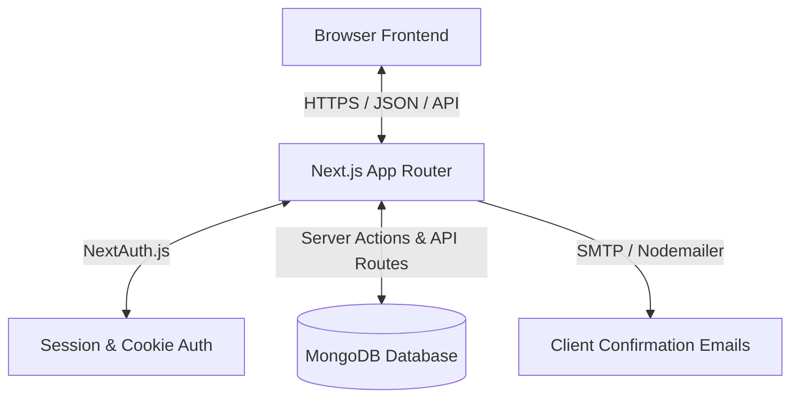
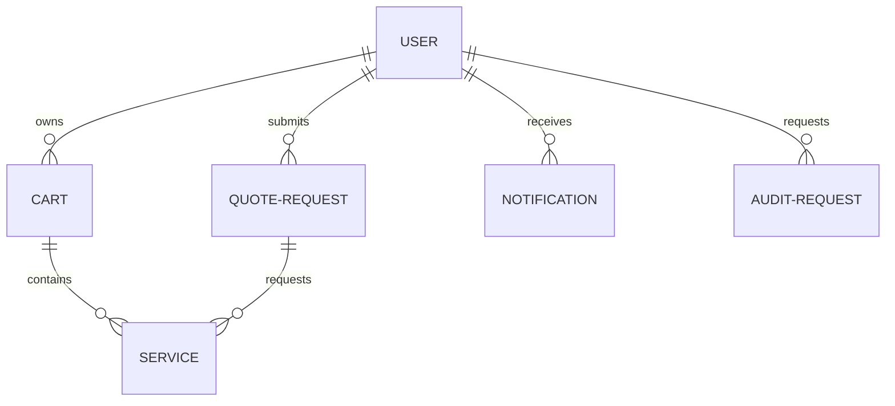
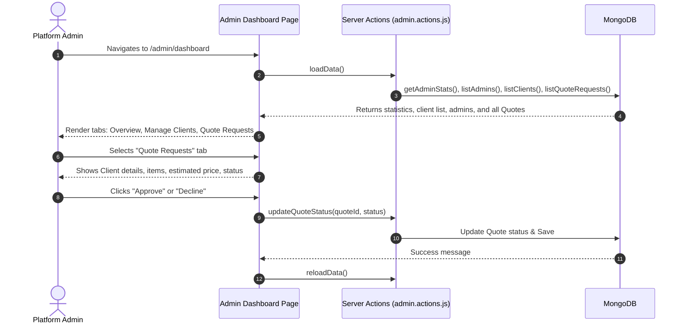

# Aritaro / aritaro Platform — Working Model & Workflows

This document outlines the architecture, database models, user workflows, and identified issues for the Aritaro / aritaro platform. It serves as a working model blueprint before making changes.

---

## 1. High-Level Architecture

The Aritaro application is built on Next.js 14+ using the App Router. It uses serverless backend logic, Mongoose/MongoDB for data persistence, NextAuth.js for credentials-based authentication, and client-side React components styled with vanilla CSS.



---

## 2. Database Models & Schema Relationships

The database is built in MongoDB with 6 primary collections defined in `src/models/`:



### Model Specifications

1. **`User`**:
   - Fields: `name`, `email`, `password` (hashed), `role` (`client` | `admin`), `isVerified`, `isSuspended`, `lastLogin`.
2. **`Service`**:
   - Fields: `name`, `slug`, `description`, `price`, `shortDescription`, `overview`, `isPublished`.
3. **`Cart`**:
   - Fields: `user` (ref: User), `items` (`serviceId`, `pricePerMonth`, `months`, `totalCost`), `totalPrice`, `discount`, `couponCode`.
4. **`QuoteRequest`**:
   - Fields: `user` (ref: User), `items` (`serviceId`, `pricePerMonth`, `months`, `totalCost`), `totalPrice`, `discount`, `couponCode`, `status` (`pending` | `approved` | `declined` | `contracted`), `notes` (client), `adminNotes` (admin).
5. **`Notification`**:
   - Fields: `user` (ref: User), `title`, `message`, `type` (`info` | `success` | `warning` | `error`), `isRead`.
6. **`ContactRequest`**:
   - Fields: `name`, `email`, `subject`, `message`, `status` (`pending` | `replied` | `closed`).

---

## 3. Core Visual Workflows

### A. Client / Normal User Journey

This flow shows how a logged-in client browses services, adds them to their cart/quote builder, and requests a custom quote.

```mermaid
sequenceDiagram
    autonumber
    actor Client as Client / Normal User
    participant Services as Services Catalog
    participant Cart as Cart Sidebar / context
    participant DB as MongoDB
    participant Dash as Quotes Dashboard

    Client->>Services: Browse Services VAPT Catalog
    Client->>Services: Click "Add to Quote"
    Services->>Cart: addToCart(service)
    Cart->>DB: POST /api/cart (Sync cart state to MongoDB)
    Client->>Cart: Open Cart Drawer, set months (e.g. 3 months)
    Client->>Cart: Click "Request Custom Quote"
    Cart->>DB: POST /api/quotes (Convert Cart into QuoteRequest)
    Note over DB: Cart is cleared; Notification created;<br/>Confirmation Email triggered.
    DB-->>Cart: 200 OK (Returns quoteId)
    Cart->>Dash: Redirect to /dashboard/quotes
    Dash->>DB: GET /api/quotes
    DB-->>Dash: Load Quote list (Pending status)
```

---

### B. Admin Dashboard Workflow

This flow shows how an Administrator logs in, accesses the Admin Dashboard, views incoming custom quotes, and updates their status.



---

## 4. Analysis of Current Issues & Bugs

Based on code inspection, here are the main bugs preventing the system from working properly:

### 1. Admin Actions Crash (`User.create(...).select(...).lean()` is not a function)
* **Location**: `src/actions/admin.actions.js` inside `createAdmin` (lines 109-117).
* **The Bug**:
  ```javascript
  const admin = await User.create({ name, email, ... })
      .select("name email isVerified isSuspended createdAt lastLogin")
      .lean();
  ```
  In Mongoose, `.create()` executes immediately and returns a document instance. It does **not** return a query object, meaning you cannot call `.select()` or `.lean()` on it. This causes a hard crash (`TypeError: User.create(...).select is not a function`) when an admin tries to create another admin.
* **Solution**: Create the admin and then return a sanitized plain JavaScript object.

### 2. Client Side "Quota Builder" & "Settings" Pages are Dummy Links
* **The Issue**: In the Client Dashboard sidebar, pages like "Settings", "Profile", and some sections in the "Quota Builder" are static mockups or lead to empty URLs/404s.
* **Solution**: Implement minimal working configurations for client profile/settings and link them correctly.

### 3. Admin Dashboard Tabs "Blogs", "Services", and "Contact Requests" are Dummy
* **The Issue**: The navbar tabs on the Admin Panel sidebar (`ManageBlogs`, `ManageServices`, `ManageContactRequests`) do not have functional backends. Clicking them shows blank state mockups, and there is no UI to add new services or view contact forms.
* **Solution**: Create database connections and actions to list and delete contact requests, and list/edit services.

### 4. Quote Requests Mismatch / Validation Failures
* **The Issue**: When a user creates a quote, if the calculated price has even a slight mismatch with `totalPrice` due to rounding, the schema validator in `QuoteRequest.js`:
  ```javascript
  validate: {
      validator: function (value) {
          return value === itemsTotal - discount;
      }
  }
  ```
  will fail, throwing a Mongoose Validation Error. Additionally, if the services table doesn't have the pre-populated services matching the frontend catalog slugs (e.g. `api-pt`, `wap-pt`), the cart synchronization tries to dynamically create them, which might result in incomplete data.

---

## 5. Proposed Next Steps
Once you review this working model:
1. Fix the `admin.actions.js` createAdmin crash.
2. Ensure the pre-seeding of services is robust so that when a normal user adds a service to their cart, it links correctly.
3. Hook up the Quote Requests tab inside the Admin Dashboard so they can approve/decline in real-time.
4. Implement basic CRUD operations for the dummy screens.
